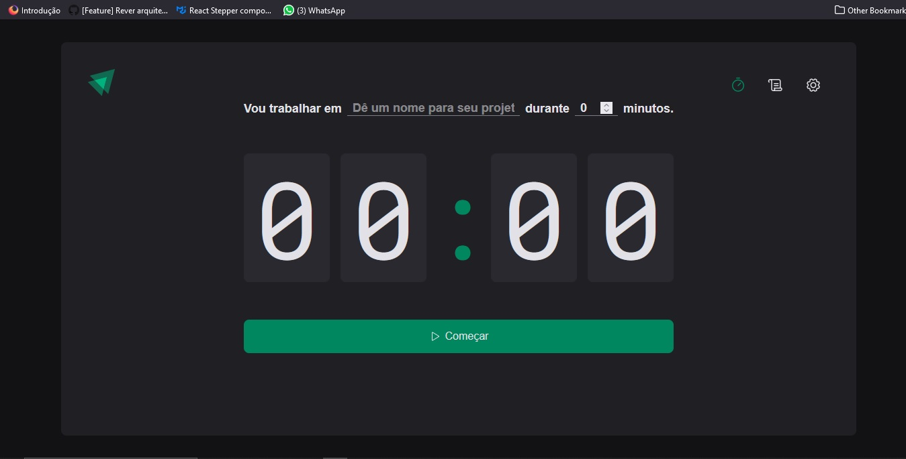

# Timer




> Projeto feito na trilha de react da Rocketseat, utilizando React Js + typescript, cujo a intenção é criar um timer para execução de tarefas, você insere a tarefa e o tempo para executar ela, podendo interrompê-la. O sistema conta também com um histórico das tarefas.

## 💻 Pré-requisitos

Antes de começar, verifique se você atendeu aos seguintes requisitos:

* Você instalou a versão mais recente de Node

## 🚀 Instalando Timer

Para instalar o timer, siga estas etapas:

No terminal do seu editor de código:
```
git clone https://github.com/netosouza22/timer.git
```

## ☕ Usando timer

Para usar timer, siga estas etapas:

Para instalar os projetos com o terminal aberto na pasta do projeto, digite:
```
yarn install
```
ou 
```
npm i
```
para iniciar o projeto:
```
yarn dev
```
ou
```
npm run dev
```

## 🤝 Colaboradores

Agradecemos às seguintes pessoas que contribuíram para este projeto:

<table>
  <tr>
    <td align="center">
      <a href="#">
        <br>
        <sub>
          <b>Neto Sousa</b>
        </sub>
      </a>
    </td>
  </tr>
</table>

## 📝 Licença

Esse projeto está sob licença. Veja o arquivo [LICENÇA](LICENSE.md) para mais detalhes.
